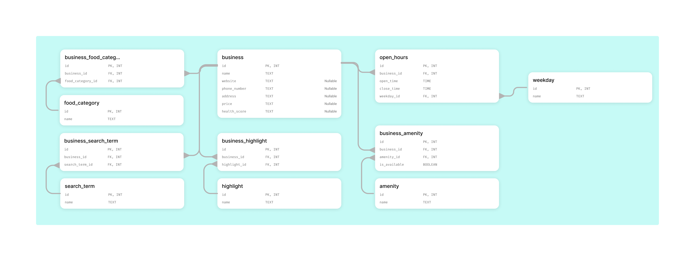

## Yelp Scraper and API for Las Vegas Restaurants

### Overview
This project includes:

- **Web Scraper**: Collects data of Las Vegas restaurants from [yelp](https://www.yelp.com/search?find_desc=Restaurants&find_loc=Las+Vegas).
- **Database Setup**: Cleaning, transforming, and structuring data into a normalized relational model.
- **API Endpoints**: RESTful endpoints to query restaurants data.

### Setup instructions

#### 1. Clone the repository

```bash
git clone https://github.com/malbiruk/yelp-data-engineering-pipeline.git
cd yelp-data-engineering-pipeline
```

#### 2. Setup environment
You can use **pip + virtualenv** or **conda**:

##### Option 1: Using `pip` and `venv`

```bash
python -m venv venv
source venv/bin/activate
pip install -r requirements.txt
```

##### Option 2: Using `conda`

```bash
conda env create -f environment.yml
conda activate yelp-data-engineering-pipeline
```

### Web scraping

#### Input files

- `proxies_list.txt` (inside `web_scraper` folder).

Format of `proxies_list.txt` (each proxy on a new line):
```
login:password@ip:port
```

#### Run the scraper

```bash
cd web_scraper
python web_scrapping.py
```

#### Output files

The scraper produces newline-delimited JSON (`.ndjson`) files.

##### 1. `businesses.ndjson`

This file contains basic information about businesses, collected from the search results pages.

Each line is a JSON object representing a business with fields such as:
```json
{
  "bizId": "example-business-id",
  "ranking": 1,
  "name": "Example Business",
  "businessUrl": "https://www.yelp.com/biz/example-business"
}
```

This file serves as an **intermediate step**, providing URLs for detailed scraping.

##### 2. `results.ndjson`

The script then iterates over the `businesses.ndjson` file, visiting each business URL to extract the details.

Each line contains scraped business data with fields such as:

```json
{
  "bizId": "example-business-id",
  "ranking": 1,
  "name": "Example Business",
  "website": "https://www.example-business-website.com",
  "phone_number": "(123) 456-7890",
  "open_hours": [
    {"weekday": "Mon", "open_hours": "11:00 AM - 11:30 PM"},
    {"weekday": "Tue", "open_hours": "11:00 AM - 11:30 PM"},
    {"weekday": "Wed", "open_hours": "11:00 AM - 11:30 PM"}
  ],
  "address": "Some Address in Las Vegas, NV",
  "food_category": ["Category 1", "Category 2"],
  "price": "$$$",
  "health_score": "A",
  "amenities": [
    {"amenity": "Amenity 1", "is_available": true},
    {"amenity": "Amenity 2", "is_available": false},
    {"amenity": "Amenity 3", "is_available": true}
  ],
  "highlights": ["Highlight 1", "Highlight 2", "Highlight 3"],
  "related_search_terms": ["Search term 1", "Search term 2", "Search term 3"]
}
```

This file contains all required data and is ready for further processing and database import.

### Data engineering & database setup

#### Database folder overview

The `database/` folder contains all database-related components, including schema definitions, migrations, and the API. Below is an overview of its structure:

```
database/
├── yelp_db/                   # Main package containing DB modules
│   ├── __init__.py
│   ├── base/                  # Handles database connection
│   │   ├── __init__.py
│   │   └── connect.py         # Defines async DB connection
│   └── yelp_db/               # Stores migrations and schema definitions
│       ├── alembic/           # Alembic migrations
│       ├── __init__.py
│       ├── alembic.ini        # Alembic config file
│       ├── connect.py         # Loads .env and initializes DB connection
│       └── model.py           # SQLAlchemy models (tables)
├── app.py                     # FastAPI application with API endpoints
├── docker-compose.yml         # Docker setup for PostgreSQL
├── parse_and_upload_to_db.py  # Script to parse and upload scraped data
└── yelp_restaurants_erd.png   # ERD schema visualization
```

#### Database schema overview

The database follows a normalized relational model to efficiently store and query scraped restaurants data. Below is the Entity-Relationship Diagram (ERD):

 

#### Database setup

##### 1. Move to the `database/` folder

If you're in the `web_scraper/` folder:

```bash
cd ../database
```

##### 2. Create a `.env` file
In the `database/` folder, create a `.env` file with the contents such as:

```bash
DB_USER="user"
DB_PASSWORD="password"
DB_HOST="127.0.0.1"
DB_PORT=5432
DB_DB="database"
```

These environment variables will be used for database configuration.

##### 3. Start PostgreSQL using Docker

Run the following command to pull PostgreSQL image and start the PostgreSQL database container:

```bash
docker compose up -d
```

This will initialize an empty database with the specified credentials.

##### 4. Apply database migrations

Navigate to the migrations folder:

```bash
cd yelp_db/yelp_db/
```

Run Alembic migrations to create the required tables:

```bash
alembic upgrade head
```

##### 5. Upload scraped data to the database

Navigate back to the `database/` folder:

```bash
cd ../..
```

Run uploading script to populate the database with scraped data:

```bash
python parse_and_upload_to_db.py
```

### API endpoints

To start the FastAPI server, run the following command in the `database/` folder:

```bash
uvicorn app:app
```

The API will be available at [http://127.0.0.1:8000/](http://127.0.0.1:8000/).

All endpoints support pagination using the query parameters:

- `page` (default: `1`)
- `page_size` (default: `10`)

Each response includes the total number of results for reference.

#### Get business by category

**Endpoint**:

```http
GET /restaurants/category/{category}
```

**Description**:

Returns a list of businesses that belong to the specified food category.

**Path Parameter**:

`{category}` can be either:
- A number (category ID in the database)
- A string (valid category name, e.g., "Pizza" or "Sushi")

**Example requests**:

```bash
curl -X GET "http://127.0.0.1:8000/restaurants/category/Pizza"
curl -X GET "http://127.0.0.1:8000/restaurants/category/3"
```

#### Get business by weekday

**Endpoint**:

```http
GET /restaurants/day/{weekday}
```

**Description**:

Returns a list of businesses that are open on the specified weekday.

**Path Parameter**:

`{weekday}` can be either:
- A number (weekday ID in the database)
- A 3-letter string (e.g., "Mon", "Tue", "Wed")

**Example requests**:

```bash
curl -X GET "http://127.0.0.1:8000/restaurants/day/Fri"
curl -X GET "http://127.0.0.1:8000/restaurants/day/5"
```

#### Get business open right now

**Endpoint**:

```http
GET /restaurants/now
```

**Description**:

Returns a list of currently open businesses, along with:

- Their closing time
- The time remaining until closing

Since the scraped data is only from Las Vegas, the timezone is hardcoded to Pacific Time (PST/PDT). A potential enhancement would be to store the timezone in the `open_hours` table for flexibility.

**Example request**:

```bash
curl -X GET "http://127.0.0.1:8000/restaurants/now"
```

**Example response**:

```json
{
  "page": 1,
  "page_size": 10,
  "total_results": 134,
  "restaurants": [
    {
      "Business": {
        "address": "3570 Las Vegas Blvd S Las Vegas, NV 89109",
        "name": "Gordon Ramsay Hell's Kitchen",
        "website": "https://www.gordonramsayrestaurants.com/hells-kitchen-caesars-palace/",
        "health_score": "A",
        "id": 1,
        "phone_number": "(702) 731-7373",
        "price": "$$$"
      },
      "close_time": "23:30:00",
      "time_until_close": "7:25:00.858542"
    },
    {
      "Business": {
        "address": "3550 S Decatur Blvd Las Vegas, NV 89103",
        "name": "888 Japanese BBQ",
        "website": "https://888japanesebbq.com",
        "health_score": null,
        "id": 2,
        "phone_number": "(702) 476-5033",
        "price": "$$$"
      },
      "close_time": "01:00:00",
      "time_until_close": "8:55:00.858512"
    }
  ]
}
```
